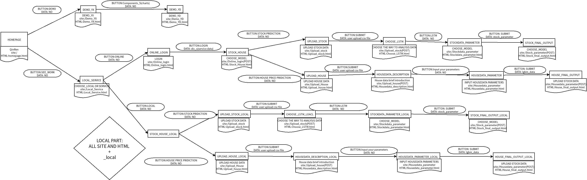
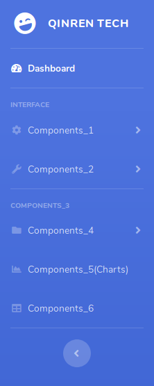
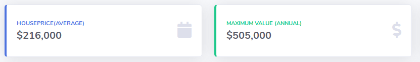
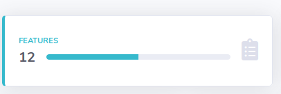
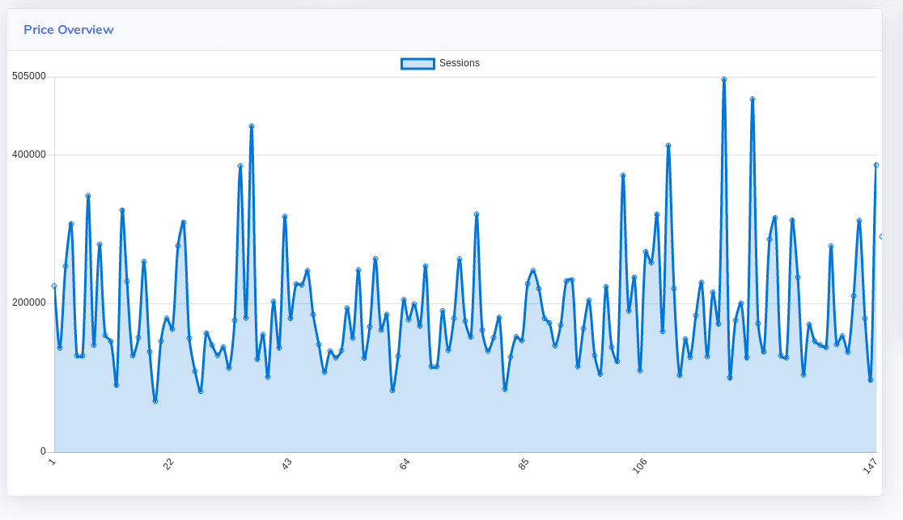
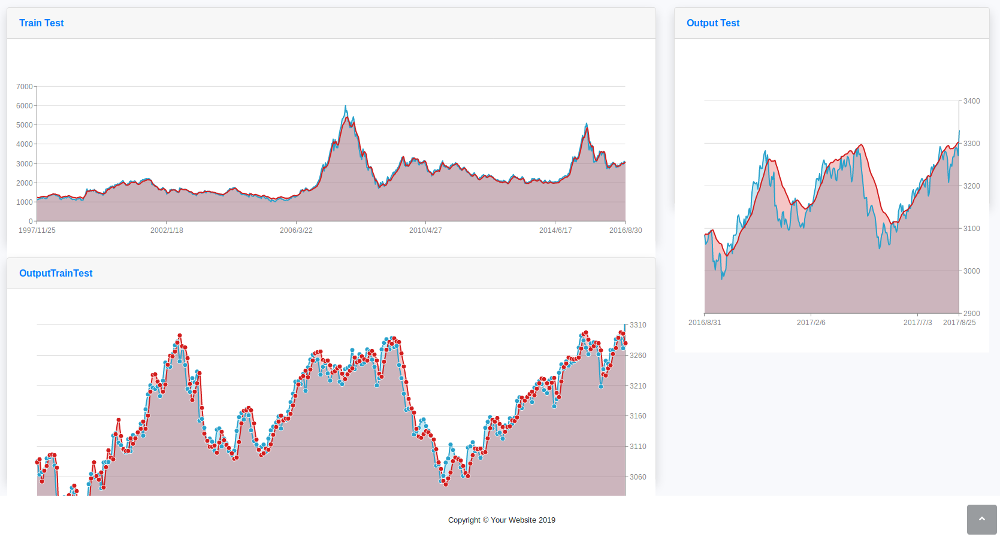

# README


流程图：


  


运行:

```
pip install -r requirements.txt
python app.py
```


**Demo_YX.html:**

​		side bar:




​		对应主标题Components_1部分:

```html
        <a class="nav-link collapsed" href="#" data-toggle="collapse"datat-arget="#collapseTwo" aria-expanded="true" aria-controls="collapseTwo">
          <i class="fas fa-fw fa-cog"></i>
          <span>Components_1</span>
        </a>
```

​			i标签**对应**class**中**fa-cog**代表主标题前方图标**.

​			其中**data-toggle**与 **aria-controls**保持一致,与下方表示子标题Components_1_0,Components_1_1,Components_1_2的id保持一致.

​			href表示对应的网页域名.

```html
		<div id="collapseTwo" class="collapse" aria-			 labelledby="headingTwo" data-parent="#accordionSidebar">
          <div class="bg-white py-2 collapse-inner rounded">
            <h6 class="collapse-header">Components_1_0</h6>
            <a class="collapse-item" href="#">Components_1_1</a>
            <a class="collapse-item" href="#">Components_1_2</a>
          </div>
        </div>
```

​	card:



​	

```html
            <div class="col-xl-3 col-md-6 mb-4">
              <div class="card border-left-primary shadow h-100 py-2"><!--card边框阴影范围 -->
                <div class="card-body">
                  <div class="row no-gutters align-items-center"><!--card内容排版-->
                    <div class="col mr-2">
                      <div class="text-xs font-weight-bold text-primary text-uppercase mb-1">HousePrice(Average)</div> <!--标题字体格式选定-->
                      <div class="h5 mb-0 font-weight-bold text-gray-800">$216,000</div><!--内容字体格式选定-->
                    </div>
                    <div class="col-auto">
                      <i class="fas fa-calendar fa-2x text-gray-300"></i><!--图标格式选定-->
                    </div>
                  </div>
                </div>
              </div>
            </div>
```

​		<i class="fas fa-calendar fa-2x text-gray-300"></i> 中**fa-calendar**部分表示图表类型.

​		<div class="text-xs font-weight-bold text-primary text-uppercase mb-1">中**text-primary**部分表示字体颜色

​		图表类型与字体样式具体内容见sb-admin-2.css

​	progressbar-card:

​		

```html
<div class="col">
	<div class="progress progress-sm mr-2">
		<div class="progress-bar bg-info" role="progressbar" style="width: 50%" aria-valuenow="80" aria-valuemin="0" aria-valuemax="100">
            <!-- 进度条格式设定 class中bg-info部分确定背景色  style中width部分决定进度条长度 -->
        </div>
	</div>
</div>
```

​		YX_scatter(Demo_YX.html):



​			html部分:

```html
<div class="col-xl-8 col-lg-7">
     <div class="card shadow mb-4">
         <!--card格式设定-->
          <div class="card-header py-3 d-flex flex-row align-items-center justify-content-between"><!--标题字体格式设定 -->
               <h6 class="m-0 font-weight-bold text-primary">Price Overview</h6>
                  
           </div>
           <div class="card-body-lg" style="height:550px">
               <!--card内部空间排版-->
                <div class="chart-area">
                    <canvas id="myAreaChart">
                    </canvas><!--图像表示部分 -->
                 </div>
            </div>
      </div>
</div>
```

​			JavaScript部分(/static/js/demo/chart-area-demo.js):

```javascript
var ctx = document.getElementById("myAreaChart");
var myLineChart = new Chart(ctx, {
  type: 'line',
  data: {
    labels: [// x轴
    			],
    datasets: [{
      label: "Sessions",
      lineTension: 0.3,
      backgroundColor: "rgba(2,117,216,0.2)",
      borderColor: "rgba(2,117,216,1)",

      data: [// y轴
      		],
    }],
  },
  options: {
    scales: {
      xAxes: [{
        time: {
          unit: 'date'
        },
        gridLines: {
          display: false
        },
        ticks: {
          maxTicksLimit: 7  
        }
      }],
      yAxes: [{
        ticks: {
          min: 0,
          max: 505000,
          maxTicksLimit: 5
        },
        gridLines: {
          color: "rgba(0, 0, 0, .125)",
        }
      }],
    },
    legend: {
      display: true
    }
  }
});

```

​	        id与HTML部分<canvas>id保持一致.

​		可采用各种js库(如chart.js,zingcharts等方式)作图.原生采用chart.js

库.

**Demo_YD.html**

​	YD_scatter:



​		

```html
<div class="row">

    <div class="col-xl-8 col-lg-7"><!--不同card分布排版-->

        <div class="card shadow mb-4"><!--card主体-->
            <div class="card-header py-3"><!--card标题-->
                <h6 class="m-0 font-weight-bold text-primary">Train Test</h6>
            </div>
            <div class="card-body-lg"><!--card图像部分-->
                <div class="chart-area">
                    <div id="line_1" style="width: 100%;height: 350px;top: 0px;border:1px;margin:20px auto;"><!--确定作图排版-->
                    </div>
                    <script>
                        <!--作图部分-->
                    </script>                    
                </div>

            </div>
        </div>

        <div class="card shadow mb-4">
            <div class="card-header py-3">
                <h6 class="m-0 font-weight-bold text-primary">OutputTrainTest</h6>
            </div>
            <div class="card-body-lg">
                <div class="chart-bar">
                    <div id="line_2" style="width: 100%;bottom: 70px;border:1px;margin: auto;">
                    </div>
                    <script>
                        <!--作图部分 -- >
                    </script>
                </div>

            </div>
        </div>

    </div>

    <div class="col-xl-4 col-lg-5"">
                                   <div class="card shadow mb-4" >
                                                                <!-- Card Header - Dropdown -->
                                                                <div class="card-header py-3" ">
        <h6 class="m-0 font-weight-bold text-primary">Output Test</h6>
    </div>
    <!-- Card Body -->
    <div class="card-body-lg" ">
                               <div class="chart-pie pt-4" ">
        <div id="line" style="width: 100%;border:1px;margin:20px auto;">
        </div>
        <script>
            <!--作图部分 -- >
        </script>
    </div>

</div>
```

​		可采用各种js库(如chart.js,zingcharts等方式)作图.此处采用zingcharts.


main.py:

​	输入data.csv文件,输出outputTrain.csv, outputTest.csv, outputTrainTest.csv

​	根据输出csv文件通过app.py进行数据处理后上传至前端,进行可视化展示	

app.py:

​	YD数据处理与上传部分:

```python
@app.route('/Stockdata_parameter',methods=['GET','POST'])      #upload YD module parameter
def Stockdata_parameter():
    def get(name):
        return request.values.get(name)
    if request.method == 'POST':
        dic={}
        dic['e'] = int(get('e'))
        dic['lb'] = int (get('lb'))
        dic['lr'] = float (get('lr'))
        dic['tp'] = float (get('tp'))
        ssh_s=SSHConnection(dic_s['host'],dic_s['port'],dic_s['username'],dic_s['password'])
        ssh_s.connect(  )
        s='cd py2;source bin/activate;cd ..;cd FlaskIndexPrediction;python main.py -e {e} -lb {lb} -lr {lr} -tp{tp}'
        ssh_s.cmd(s.format(e=dic['e'],lb=dic['lb'],lr=dic['lr'],tp=dic['tp']))


        ssh_s.download(dic_s['remote work directory path'] + '/FlaskIndexPrediction/output/outputTest.csv', str(os.getcwd())  + '\\' +  'outputTest.csv')
        ssh_s.download(dic_s['remote work directory path'] + '/FlaskIndexPrediction/output/outputTrain.csv',str(os.getcwd())  + '\\' +  'outputTrain.csv')
        ssh_s.download(dic_s['remote work directory path'] + '/FlaskIndexPrediction/output/outputTrainTest.csv',str(os.getcwd())  + '\\' +  'outputTrainTest.csv')


        outputTest = pd.read_csv('YD/outputTest.csv')
        outputTrain = pd.read_csv('YD/outputTrain.csv')
        outputTrainTest = pd.read_csv('YD/outputTrainTest.csv')
        Test_time = outputTest['Unnamed: 0']
        Test_origin = outputTest['origin']
        Test_predict = outputTest['predict']
        Train_time = outputTrain['Unnamed: 0']
        Train_origin = outputTrain['origin']
        Train_predict = outputTrain['predict']
        TrainTest_time = outputTrainTest['Unnamed: 0']
        TrainTest_origin = outputTrainTest['origin']
        TrainTest_predict = outputTrainTest['predict']

        stock_data={'Test_time':Test_time,'Test_origin':Test_origin,
        'Test_predict':Test_predict,'Train_time':Train_time,
        'Train_origin':Train_origin,'Train_predict':Train_predict,
        'TrainTest_time':TrainTest_time,'TrainTest_origin':TrainTest_origin,
        'TrainTest_predict':TrainTest_predict}
        return render_template('Stock_final_output.html',stock_data = stock_data)
    else:
        return render_template('Stockdata_parameter.html')
```

YX数据处理上传部分:

```python
@app.route('/Housedata_parameter',methods=['GET','POST'])			#YX modules brief_SERVICE
def Housedata_parameter():
    def get(name):
        return request.values.get(name)


    if request.method == 'POST':
        Id = get("Id")
        LotArea = get("LotArea")
        Neighborhood = get("Neighborhood")
        YearBuilt = get("YearBuilt")
        GrLivArea = get("GrLivArea")
        Street = get("Street")
        Utilities = get("Utilities")
        LotConfig = get("LotConfig")
        HouseStyle = get("HouseStyle")
        RoofStyle = get("RoofStyle")
        SaleType = get('SaleType')
        SaleCondition = get('SaleCondition')
        lgbm_data=[LotArea,Street,Utilities,LotConfig,Neighborhood,
        HouseStyle,YearBuilt,RoofStyle,GrLivArea,SaleType,SaleCondition]
        lgbm_data_1=",".join(lgbm_data)

        def getSortedValues(row):
            sortedValues=[]
            keys=row.keys()
            keys.sort()
            for key in keys:
                sortedValues.append(row[key])
            return sortedValues

        rows = [{'Column1': 1, 'Column2': LotArea,'Column3': Street,'Column4':Utilities,'Column5':LotConfig,
                'Column6':Neighborhood,'Column7':HouseStyle,'Column8':YearBuilt,'Column9':RoofStyle,
                'Column10':GrLivArea,'Column11':SaleType,'Column12':SaleCondition},
                ]

        names={'Column1': 'Id', 'Column2': 'LotArea','Column3': 'Street','Column4':'Utilities','Column5':'LotConfig',
                'Column6':'Neighborhood','Column7':'HouseStyle','Column8':'YearBuilt','Column9':'RoofStyle',
                'Column10':'GrLivArea','Column11':'SaleType','Column12':'SaleCondition'}


        fileobj=open("YX/test.csv",'wb')
        fileobj.write('\xEF\xBB\xBF')
        writer = csv.writer(fileobj)
        sortedValues = getSortedValues(names)
        writer.writerow(sortedValues)
        for row in rows:
            sortedValues = getSortedValues(row)
            print (sortedValues)
            writer.writerow(sortedValues)
        fileobj.close()


        ssh.upload(str(os.getcwd())  + '/YX/' +  'test.csv','/root/lgbm/test.csv')
        show = ssh.cmd('cd lgbm;python lgbm.py')
        show_l = show.split('\n')
        pred_y = eval(show_l[-2])
        pred_y_show=pred_y[0]
        quantitative = re.findall("\d+",show_l[3])[0]
        qualitative = re.findall("\d+",show_l[3])[1]
        train_x1 = show_l[6]
        train_y1 = show_l[7]
        test_x1 = show_l[8]
        return render_template('House_final_output.html',pred_y=round(pred_y_show,2),train_x1=train_x1,train_y1=train_y1
            ,test_x1=test_x1,quantitative=quantitative,qualitative=qualitative)

    else:
        return render_template('Housedata_parameter.html',mydata=mydata)

```

